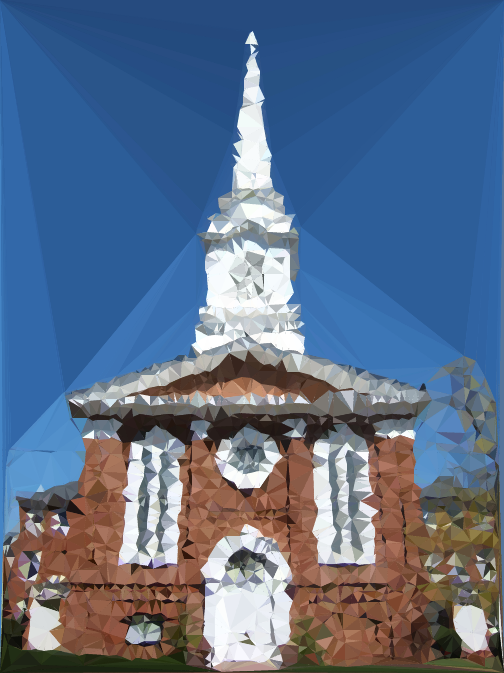

# Triangulate

Triangulate your images by dragging and dropping them to the browser.

This uses the [Bowyer-Watson Algorithm](https://en.wikipedia.org/wiki/Bowyer%E2%80%93Watson_algorithm) for generating a [Delaunay triangulation](https://en.wikipedia.org/wiki/Delaunay_triangulation) for the image.

Heavily inspired by akm2's [image triangulation generator](http://jsdo.it/akm2/xoYx).

You can also check out [Animated Triangulation](http://s4chin.github.io/triangulate-animated/) to see the triangulation in animation.
